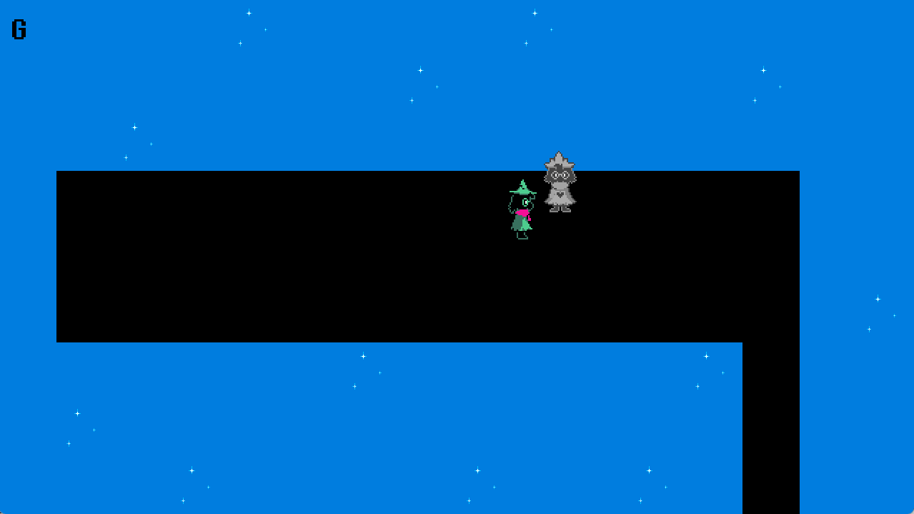
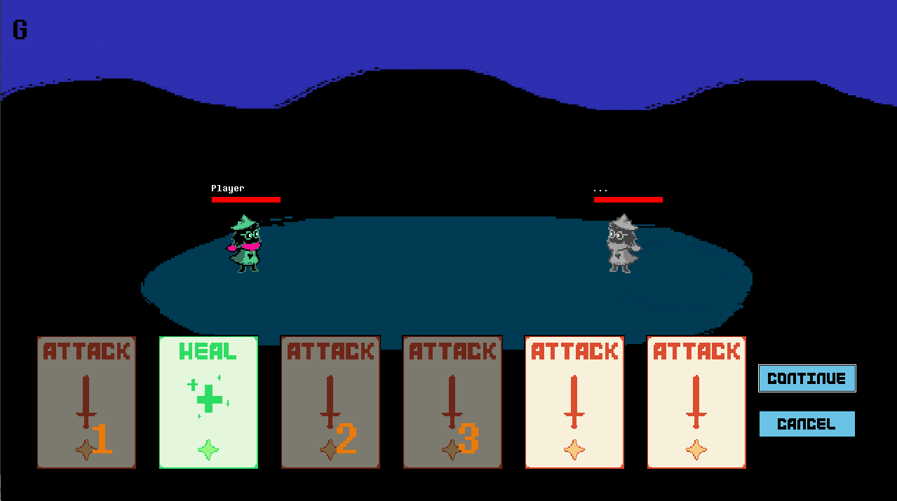
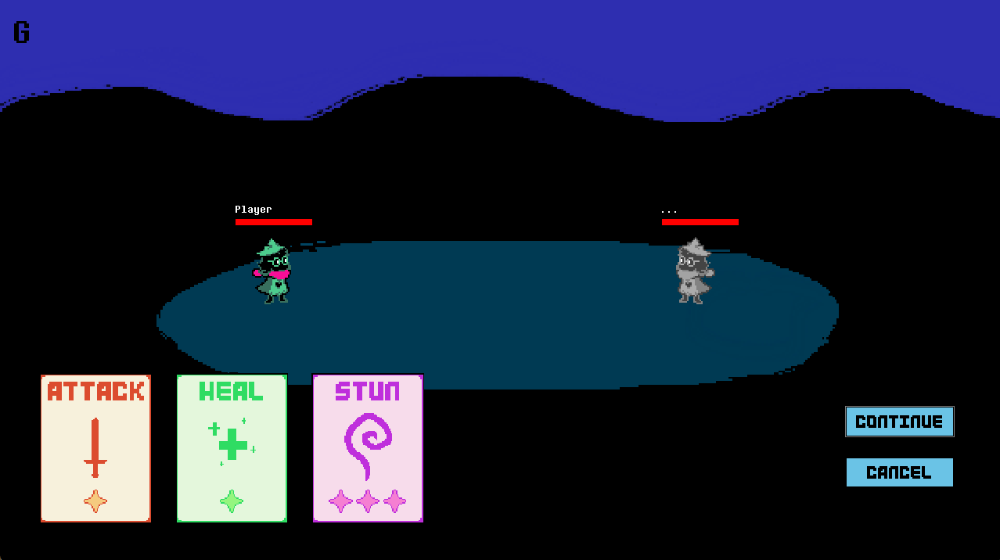
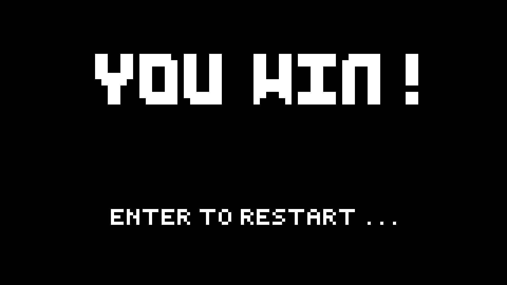
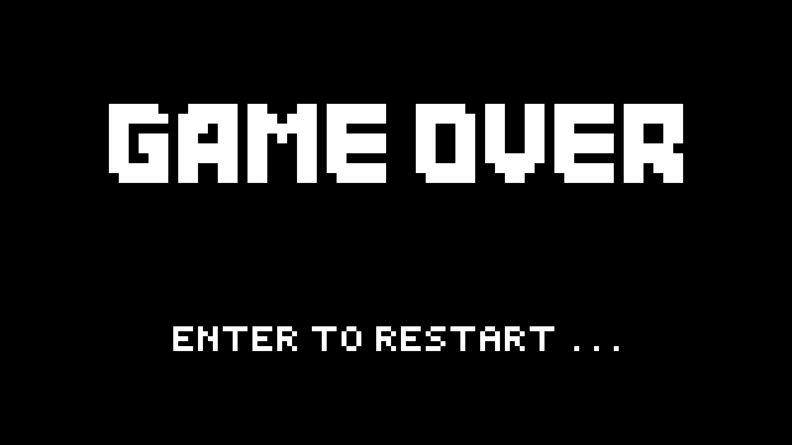

# Adventure Card Game
> Game 2D turn-based thẻ bài.
## 🎯 Features
- Điều khiển nhân vật di chuyển để tìm lối ra, trên đường đi sẽ gặp kẻ địch.
- Chạm vào kẻ địch sẽ chuyển sang chế độ chiến đấu sử dụng thẻ bài.
- Có thể ghép 2 thẻ cùng loại và cùng cấp sao thành thẻ có cấp sao cao hơn, thẻ 3 sao có hiệu ứng riêng.
## 🎮 Gameplay

*Di chuyển nhân vật (nhấn lên-xuống-trái-phải), khi chạm phải kẻ địch sẽ chuyển sang chế độ chiến đấu*

*Nhân vật có 6 thẻ, có thể chọn/ghép thẻ (nhấn G để xem hướng dẫn), sau mỗi lượt chơi sẽ bổ sung thẻ mới vào những thẻ đã dùng*

*Ghép 2 thẻ có cùng loại và cấp sao thành thẻ có cấp sao cao hơn (tối đa 3)*

*Đi đến cánh cửa để hoàn thành trò chơi*

*Màn hình chiến thắng*

*Màn hình thất bại khi nhân vật còn 0 HP*
## 📑 Development Status
- 18/03/2025: Thêm adventure scene và battle scene (chạm vào kẻ địch sẽ chuyển scene sang "battle"), điều khiển nhân vật, thẻ đơn giản.
- 21/03/2025: Thêm các loại thẻ (attack & heal, thẻ attack 3 sao = thẻ debuff, thẻ heal 3 sao = thẻ shield (tránh 1 đòn đánh)), thêm cơ chế ghép thẻ, thêm bộ thẻ (tối đa 6 thẻ).
- 25/03/2025: Thêm animation cho nhân vật, render thanh máu và tên trong battle.
- 29/3/2025: Thêm cơ chế chọn thẻ.
- 12/04/2025: Thêm lại thẻ cho đủ 6 thẻ sau mỗi turn, người chơi có tối đa 3 lượt hành động (chọn/ghép thẻ).
- 13/04/2025: Thêm nút xác nhận (continue) và reset lựa chọn (cancel).
- 25/04/2025: Thêm hướng dẫn trong adventure và battle, animation cho kẻ địch, hiệu ứng khi dùng thẻ, thêm âm thanh; thêm quy tắc chọn thẻ đơn giản cho kẻ địch; khi bị đánh bại/hoàn thành game sẽ có lựa chọn chơi lại (từ đầu).
## 🎬 Demo Gameplay
👉 [Xem video demo trên Google Drive](https://drive.google.com/file/d/1ChRQzgmRAo1bwS1PR8Dd4Y-GEEJxqCd-/view?usp=drive_link)
